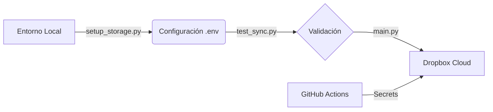

# Project-E Sync (PESync)

PESync es una herramienta de automatización en Python diseñada para gestionar la sincronización y el respaldo de componentes de emulación. El script automatiza el flujo de búsqueda, descarga y almacenamiento en la nube (Dropbox) de los siguientes recursos:

- **Emu**: El binario principal del entorno en formato `AppImage` para sistemas compatibles.
- **Licencias del sistema**: Archivos de configuración necesarios para la ejecución del emulador.
- **Actualizaciones del sistema**: Componentes base requeridos para la compatibilidad del emulador.

Esta herramienta está pensada para la gestión personal de respaldos y la automatización de la configuración del entorno de trabajo.



## 🚀 Características

- **Estado basado en Dropbox**: El script consulta directamente el almacenamiento remoto al iniciar para determinar qué recursos ya están respaldados, sin depender de archivos locales.
- **Límites de Versiones Configurable**: Permite definir cuántas versiones mantener de cada componente de forma independiente.
- **Rotación Automática y Auto-Limpieza**: El script identifica y elimina automáticamente versiones obsoletas en la nube para mantener solo lo más reciente según la configuración, optimizando el espacio.
- **Almacenamiento Seguro**: Integración con Dropbox para mantener redundancia de los componentes críticos, soportando subida de archivos de gran tamaño mediante fragmentación.
- **Robustez con Fallback**: El script está diseñado para no fallar ante configuraciones incompletas, utilizando 2 versiones como valor de respaldo seguro.
- **Registro y Resumen Detallado**: Implementación de un Console Logger para seguimiento en vivo y visualización de un resumen final de los componentes procesados.
- **Peticiones Seguras y Validadas**: Peticiones de red optimizadas mediante `requests`, validación robusta de activos descargables.
- **Verificación de Conexión**: Script dedicado para validar las credenciales almacenadas en el archivo `.env` y el acceso a Dropbox antes de iniciar procesos de sincronización.
- **Filtrado Exclusivo**: Capacidad para ignorar patrones específicos (por ejemplo, excluir archivos firmware durante respaldos de licencias).

## 📋 Requisitos Previos

- **Python 3.7+**
- Cuenta de Dropbox con acceso API.

### Instalación

Instala los módulos necesarios:

```bash
pip install -r requirements.txt
```

## ⚙️ Configuración

Para habilitar la sincronización remota, primero selecciona el proveedor de almacenamiento que deseas usar (Dropbox o Google Drive) y luego configura las variables de entorno necesarias.

### Seleccionar Proveedor de Almacenamiento

PESync soporta múltiples proveedores de almacenamiento. Para seleccionar cuál usar, configura la variable `STORAGE_PROVIDER`:

| Valor | Proveedor |
| :--- | :--- |
| `dropbox` | Dropbox (por defecto) |
| `googledrive` | Google Drive |

### Configuración de Dropbox

Para Dropbox, configura las siguientes variables de entorno:

| Variable | Propósito |
| :--- | :--- |
| `STORAGE_PROVIDER` | Establece `dropbox` |
| `DROPBOX_APP_KEY` | Llave de acceso de la API de Dropbox. |
| `DROPBOX_APP_SECRET` | Secreto de la API de Dropbox. |
| `DROPBOX_REFRESH_TOKEN` | Token de actualización de sesión. |

> [!CAUTION]
> **SEGURIDAD LÓGICA**: Nunca subas el archivo `.env` a un repositorio público. Este archivo ya está incluido en el `.gitignore` por defecto para evitar fugas de credenciales.

### Paso 1: Obtener Credenciales

Para obtener estas credenciales, ejecuta el asistente interactivo:

```bash
python setup_storage.py
```

Sigue las instrucciones en pantalla para autorizar la aplicación en tu cuenta de Dropbox. Al finalizar, el script intentará crear/actualizar el archivo `.env` automáticamente.

### Paso 2: Prueba de Conexión (Recomendado)

Antes de la primera ejecución o tras actualizar tus credenciales, verifica que todo funcione correctamente:

```bash
python test_sync.py
```

Este script valida que las llaves guardadas en el archivo `.env` (u obtenidas vía Secrets) sean funcionales y tengan los permisos necesarios.

### Configuración de Versiones

Puedes personalizar cuántas versiones respaldar editando el diccionario `BACKUP_CONFIG` al inicio de `main.py`:

```python
BACKUP_CONFIG = {
    "emu": 2,       # Versiones del Emu
    "licenses": 2,  # Versiones de Licencias
    "system": 2     # Versiones de Firmware/Sistema
}
```

> [!NOTE]
> El script utiliza un sistema de **rotación basada en la fuente**. Si una versión ya no está entre las `N` más recientes de la fuente oficial, será eliminada automáticamente de Dropbox para dejar espacio a las nuevas.

### Paso 3: Sincronización

Una vez validada la conexión, inicia el proceso de sincronización:

```bash
python main.py
```

## 🛠 Estructura

- `main.py`: Lógica central del sistema de sincronización.
- `setup_storage.py`: Utilidad de configuración inicial para el almacenamiento en la nube.
- `test_sync.py`: Script de validación de conexión y credenciales (`.env`).
- `requirements.txt`: Definición de dependencias.
